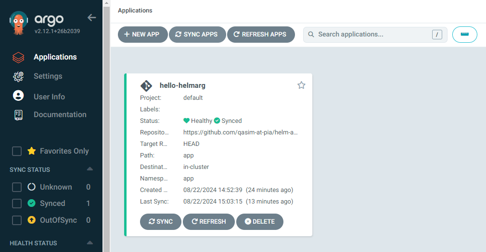
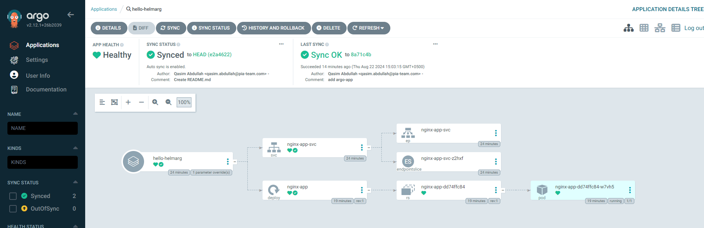

## Run

#### Cluster

```console
minikube start --kubernetes-version=v1.28.12 --memory=6G --cpus=3 --disk-size=30000mb --cni=calico --network-plugin=cni
```

#### ArgoCD Setup in Cluster

```console
kubectl create namespace argocd
kubectl apply -n argocd -f https://raw.githubusercontent.com/argoproj/argo-cd/stable/manifests/install.yaml
```

#### Retrieve ArgoCD Password

```console
kubectl -n argocd get secrets argocd-initial-admin-secret -o yaml | grep password | awk '{print $2}' | base64 -d ; echo
```

#### Access ArgoCD UI

```console
minikube service argocd-server -n argocd
```

#### Create App

```console
kubectl apply ./app.yaml
```



